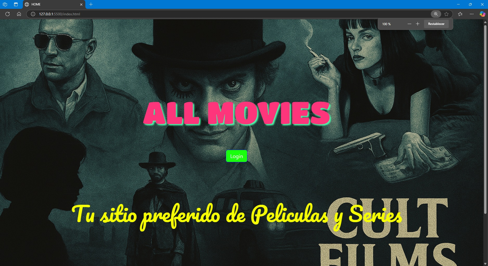
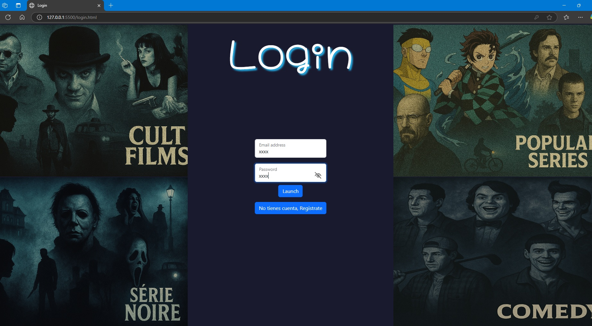
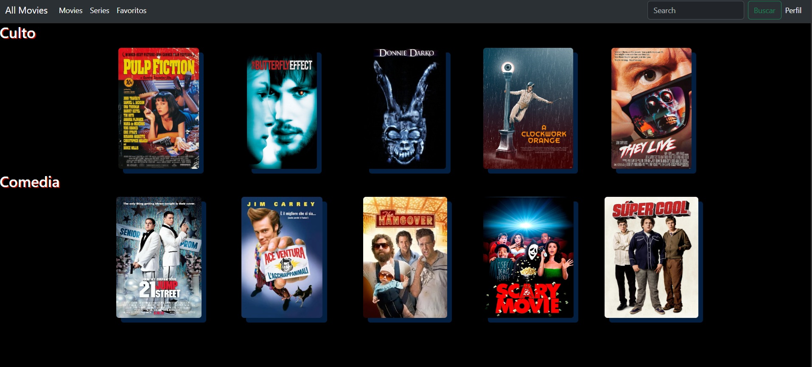
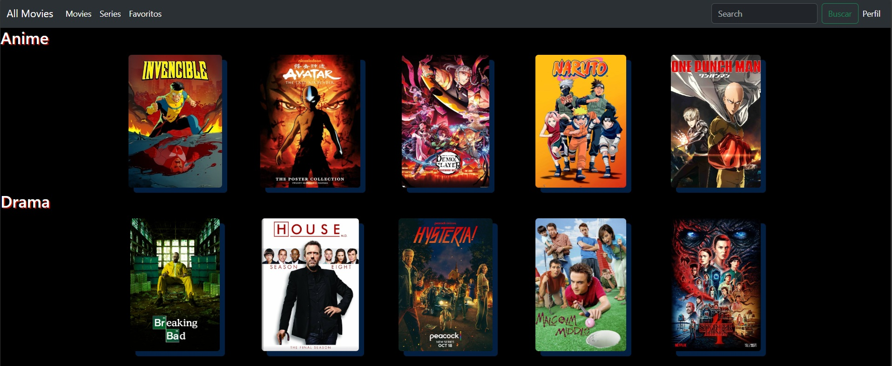
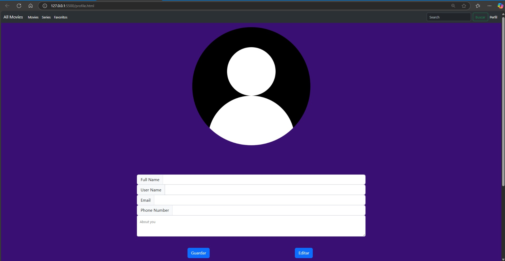

# SemilleroMega
Este repo es para subir el avance de PROYECTO "ALL"  y  en par a las seciones sincronas con el Challenger

## DAVID RICARDO CRUZ JUAREZ

**Primer entrega Sprint 1 **

### 1.-Resumen 
Esta primera entrega consta de la creación del Prototipo de baja fidelidad hecho en Canva, con diagramas de flujo en Draw.io, mi versión se centra en una plataforma de películas y series del momento, con una vista con un estilo con una composición cinemática tipo mural, con siluetas oscuras, escenas nebulosas y referencias visuales a clásicos de culto. Colores oscuros, texturas de grano cinematográfico, luces tenues como en un proyector viejo.
el nombre de mi Proyecto es "All MOVIES"

### 2. Requerimientos tecnicos - 
Esquema de baja fidelidad en Canva
Diagramda de Flujo en DrawIO para el funcionamiento de la interfaz
Desarrollado en Visual Studio Code con HTML, CSS y JS
### 3. ¿Como instalar?
Clonar el Repo en su pc en la terminal copiar el siguiente comando
      git clone https://github.com/DavidRCJ/SemilleroMega.git
### 4. Mockup de la aplicación
Un primer diseño, esta en Draw explica el Flujo de las pestañas

### 4. Capturas de pantalla - 5 capturas con explicacion
Para iniciar Abri el Index.html, y cargar el liveserver para entrar a la ventana de welcome

2.- Seleccionar Login

3.- Escribir usuario xxxx,password xxxx y presionar launch
4.- Esatras dentro de movies o series puedes interactuar con el navbar con Movies

    Series, puedes ver las series disponibles, por ahroa no pero talves en el futuro
    
    Perfil, permite agregar algunos datos
    

### 5. Proceso que seguiste para hacerlo 
1.- Cree la página de inicio o de bienvenida que me permite accesar a la pagina de Login
2.- En la pagina de Login tenemos 2 opciones cargar mi usuario si ya exite, pero si no se tiene que dar en el botón registrase para crear uno nuevo
3.- Pagina de registro nos registramos y nos devuelve a la página de login
4.- Al entrar me arroja a la sección de películas, pero en la parte superior el NAVBAR permite interactuar entre series o perfil
5.- La serie de perfil muestra una frame para agregar algunos datos del usuario

### 6. Tabla con Sprint Review 

| Que salio bien? | 
   La creacion con HTML Y CSS  no hubo problema
|Que puedo hacer diferente? |
  Mejorar la plataforma agregando una seccion de menu hamburguesas para cerrar sesion, ademas de agregar funciones de JS para validar minimo el login de carga, despues conectar a Bases de datos para alamcenar la movies o series y datos de ellas y no crear demasiadas html para cada pelicula

| Que no salio bien ? |
Detalles del CSS pero con investigacion se pudo resolver
